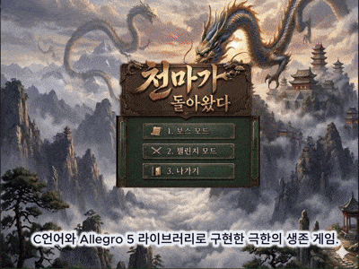
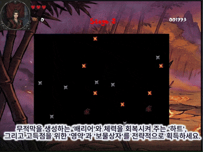
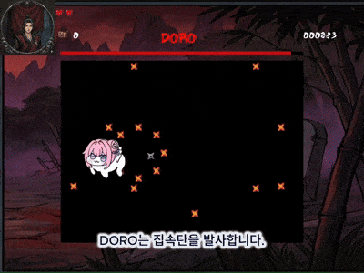

# 천마가 돌아왔다
> 몰락한 천마의 귀환, 그리고 복수의 시작

  

  

  

---

## 소개
**천마가 돌아왔다**는 Allegro5와 C 언어 기반으로 제작한  
**2D 생존 회피 / 보스전 액션 게임**입니다.

내부 배신으로 몰락한 천마교의 교주가  
죽림 숲에서 다시 일어나 복수와 재건을 향해 나아가는 이야기를 담았습니다.

---

## 첨부 자료
- **게임 소개 영상**: 실제 플레이 흐름과 화면 연출 확인 : https://youtu.be/xsbJ-VstK2Y

- **HTML 문서**: API / 함수 구조 문서 : [game_project.html](https://github.com/user-attachments/files/26392844/game_project.html)
  
- **PPTX 발표자료**: 프로젝트 발표용 슬라이드 : [천마가 돌아왔다 프로젝트 시연.pptx](https://github.com/user-attachments/files/26392834/default.pptx)

---

## 주요 기능

- 키보드 입력 기반 2D 이동
- 생존 시간 기반 점수 시스템
- 적 패턴 회피 시스템
- 보스 모드 / 챌린지 모드
- 랭킹 저장 기능
- 엔딩 분기 연출

---

## 프로젝트 정보

- **장르**: 2D 생존 회피 게임
- **개발 언어**: C
- **라이브러리**: Allegro5
- **개발 인원**: 4인 팀 프로젝트

---